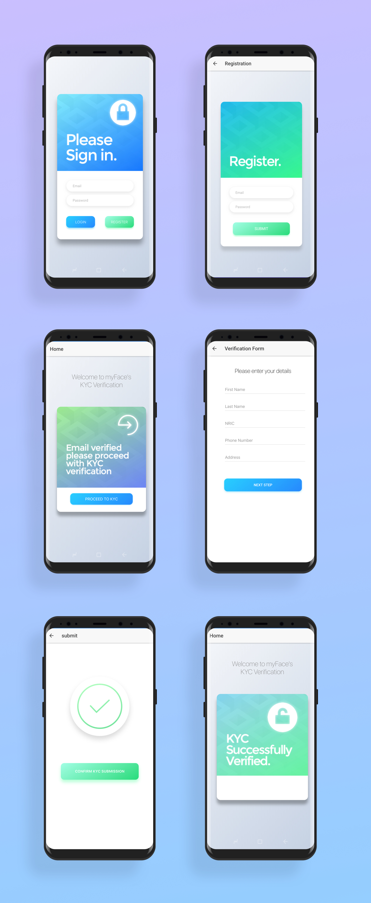

# Identity Verification App
Ionic app for cross-platform identity verification and KYC.




## Getting Started
Ionic is a cross-platform framework, and as such can be deployed on the web as well natively on devices.

In this instance, we cover local deployment and Android compiling.

### Prerequisites
* NodeJS
* Ionic 3
* npm
### Installation
1. Install NodeJS: https://nodejs.org/en/
2. Install Ionic cordova
```
$ npm install -g ionic cordova
```
## Building from source
1. Download git repo
2. In CLI, enter npm install to update all dependencies
```
$ npm install
```
3. To get the apk file
```
$ ionic cordova build android
```
## Running Demo App
1. Install the apk file located in ../Identity_Verfication/platforms/android/app/build/outputs/apk/debug/app-debug.apk

That's it!

## Running the tests

### Unit Tests

Frameworks: karma, jasmine and protractor. 
- **karma** is the Karma module which is our testing environment for unit testing. 
- **jasmine** is the Jasmine module which is the unit testing framework. 
- **protractor** is the Protractor module which is our testing environment for our end-to-end tests. 

We implemented two different kind of testing:

- Unit Testing (Karma + Jasmine)
- E2E (End-to-End) Testing
Tutorial that we follow (Unit testing for ionic is still under development, so potential bugs may happen) https://github.com/ionic-team/ionic-unit-testing-example#mocking-classes-for-ionic https://leifwells.github.io/2017/08/27/testing-in-ionic-configure-existing-projects-for-testing/

| Testpage                             | Test Case Description                             | Test Case (Example)                                                  | Test Result |
|--------------------------------------|---------------------------------------------------|----------------------------------------------------------------------|-------------|
| Initial Registration (Register Page) | Valid Email Address & Password                    | Email: qnlzgl@126.com Password: test123456                           | Pass        |
| Initial Registration (Register Page) | Invalid Email Address Format                      | Email: Email: ohmygod@TTT Password: test123456                       | Fail        |
| Initial Registration (Register Page) | Password too weak                                 | Email: guanlun_zhao@mymail.sutd.edu.sg Password: 666                 | Fail        |
| Initial Registration (Register Page) | Account not enabled					           | Email: guanlun_zhao@qq.com Password: test123456 			          | Fail        |
| Login                                | Username not found                                | Email: hahaha@126.com Password: test123456                           | Fail        |
| Login                                | Wrong Password                                    | Email: guanlun_zhao@mymail.sutd.edu.sg Password: password123         | Fail        |
| Login                                | Correct Email Address                             | Email: guanlun_zhao@mymail.sutd.edu.sg Password: This_is_password666 | Pass        |
| Login                                | User disabled Error                               | Email: guanlun.zhao@mymail.sutd.edu.sg Password: This_is_password666 | Pass        |
| Login                                | Invalid Email Address Format                      | Email: guanlun_zhao@mymail Password: This_is_password666 | Pass        |
| E2E                                  | Simulate user's using process (Selenium)          | Whole work flow                                                      | Pass        |
| MyApp                                | Root test: Assert the page initialize successfully| assert existence of server / page                                    |             |

Languages & Frameworks: Angular, Typescript, Ionic, NodeJS
Testing Frameworks: Jasmine & Karma

Import Command

Unit Testing: npm run test (Run unit test, jasmine & karma)
E2E Testing Run IonicTest.java
P.S. All unit testing has file name pattern “*.spec.ts”, under each page folder, testing case is written in typescript and jasmine syntax.

Reminder
Make sure to serve browser in chrome instead of safari
ionic serve --browser "google chrome"
Serve ionic app first before run e2e test (IMPORTANT)

## Features
* User registration and secure recurrent login
* Easy-to-use KYC procedure
* Basic profile input
* Selfie and passport scan upload
* Redirection to customer portal
* Instant verification with facial recognition
* Instant email updates to user for registration and KYC status

## To-do
* KYC-Form fields regex verification
* Firebase UploadTaskSnapshot to return img download URL after upload, to be passsed into python server
* Summary page before KYC submission
* Remove ability to backtrack during KYC
* Progress bar of KYC
* Pretty up the interface!

## Authors

See also the list of [contributors](https://github.com/orgs/myFace-KYC/people) who participated in this project.

## License

This project is licensed under the MIT License - see the [LICENSE.md](LICENSE.md) file for details

## Acknowledgments

* https://ionicframework.com/docs/intro/tutorial/
* http://ccoenraets.github.io/ionic-tutorial/
* https://www.joshmorony.com/building-a-crud-ionic-2-application-with-firebase-angularfire/
* https://firebase.google.com/docs/auth/
